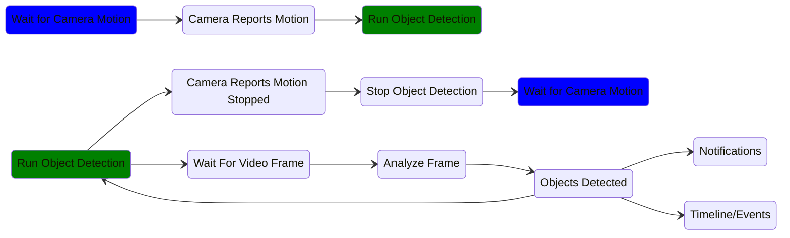

# Troubleshooting

Choose from the following troublehsooting guides. If your issue is not listed, please join [Discord](https://discord.gg/DcFzmBHYGq) and report the bug in the `#nvr` channel.

Troubleshoot:

* [Object Detection](#object-detection)
* [Recording](#recording)
* [Event Debug Tool](#event-debug-tool)

## Object Detection

### Detection Flow Chart

Object Detection failure is typically due to the camera hardware not properly supplying motion events. View the camera in the NVR and verify there are motion events in the `Timeline`. Detected Motion will be denoted with a thin and solid blue line, as seen below.

No Motion Detected

Detected Motion

If there is no motion visible on the timeline, the camera is misconfigured and not reporting motion properly. Enable the camera's hardware [Motion Sensor](/camera-preparation#motion-sensor-setup) via the manufacturer admin webpage or app. Ensure there are no zones filtering the motion.

In some cases, the camera motion sensor may be unreliable or non functional. Scrypted NVR provides software motion detection options to fill this gap. [Enable the WebGL or WebAssembly Motion Detection Extension](/detection/motion-detection) on the camera.

If the motion sensor is functional, the Object Detection itself can be tested by dropping an image into it. Save the following image and dropping it into `Scrypted NVR Object Detection`:

Sample Image

Detected Objects

## Recording

Recording issues typically stem from the storage directory or device not being properly configured.

1. In the `Scrypted NVR Plugin` Settings, verify the storage directory is configured and is reporting the correct disk size and free space. The drive should ideally be at least 1 terabyte.
2. Refer to the [Recording Storage](/scrypted-nvr/installation.html#recording-storage) docs to properly format the drive with the correct filesystem and, if applicable, mount it into Docker.

## Event Debug Tool

The event debug tool provides insight into what objects and motion was detected during an event. The tool is accessible via a **desktop browser only**. Click the camera label to go to the Event Debug Tool.

No Motion Detected

Detected Motion

## High CPU Usage

Scrypted NVR will use considerable CPU and GPU while performing object detection on [cameras that have reported motion](#object-detection). The following will help diagnoes unusual system activity.

### Verify GPU

Improperly configured systems may not be able to access the GPU when performing object detection. The official install scripts will typically set up the system correctly. The GPU availability can be verified by checking the `OpenVINO` or `ONNX` plugins.

### Camera Activity

Cameras that are actively performing object detection can be viewed in the `Video Analysis Plugin`. If the high cpu usage is persistent, it may be due to cameras that are constantly reporting motion and never going idle. For example, trees blowing in the wind will trigger object detection. To resolve this issue, use motion zones *on the camera* to reduce unimportant motion that is reported to Scrypted. For example, zoning the camera to only perform motion detection on walkways and driveways, rather than on landscaping features.
