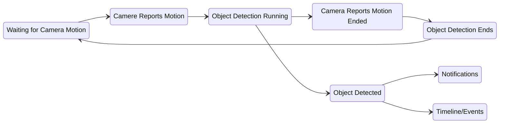

# Troubleshooting

Choose from the following troublehsooting guides. If your issue is not listed, please join [Discord](https://discord.gg/DcFzmBHYGq) and report the bug in the `#nvr` channel.

Troubleshoot:

* [Object Detection](#object-detection)
* [Recording](#recording)

## Object Detection

### Detection Flow Chart

Object Detection failure is typically due to the camera hardware not properly supplying motion events. View the camera in the NVR and verify there are motion events in the `Timeline`. Detected Motion will be denoted with a thin and solid blue line, as seen below.

No Motion Detected

Detected Motion

If there is no motion visible on the timeline, the camera is misconfigured and not reporting motion properly. Enable the camera's hardware [Motion Sensor](/camera-preparation#motion-sensor-setup) on via the manufacturer admin webpage or app. Ensure there are no zones filtering the motion.

In some cases, the camera motion sensor is unreliable or non functional. Scrypted NVR provides software motion detection options to fill this gap. [Enable the WebGL or WebAssembly Motion Detection Extension](/motion-detection) on the camera.

## Recording

Recording issues typically stem from the storage directory or device not being properly configured.

1. In the `Scrypted NVR Plugin` Settings, verify the storage directory is configured and is reporting the correct disk size and free space. The drive should ideally be at least 1 terabyte.
2. Refer to the [Recording Storage](/scrypted-nvr/installation.html#recording-storage) docs to properly format the drive with the correct filesystem and, if applicable, mount it into Docker.
